## DG0598 Demo Guide


Smart Fusion 2 Dual-Axis Motor Control Starter Kit

---

50200598. 7.0 12/17

Microsemi Corporate HeadquartersOne Enterprise, Aliso Viejo,CA 92656 USAWithin the USA: +1 (800) 713-4113 Outside the USA: +1 (949) 380-6100Fax: +1 (949) 215-4996Email: sales.support@microsemi.com

**Microsemi 公司总部**
One Enterprise, Aliso Viejo, CA 92656 美国
美国境内：+1 (800) 713-4113
美国境外：+1 (949) 380-6100
传真：+1 (949) 215-4996
电子邮件：sales.support@microsemi.com

© 2016 Microsemi Corporation. All rights reserved. Microsemi and the Microsemi logo are trademarks of Microsemi Corporation. All other trademarks and service marks are the property of their respective owners

© 2016 Microsemi 公司。版权所有。Microsemi 和 Microsemi 徽标是 Microsemi 公司的商标。所有其他商标和服务标志均为其各自所有者的财产。

Microsemi makes no warranty, representation, or guarantee regarding the information contained herein or the suitability of its products and services for any particular purpose, nor does Microsemi assume any liability whatsoever arising out of the application or use of any product or circuit. The products sold hereunder and any other products sold by Microsemi have been subject to limited testing and should not be used in conjunction with mission-critical equipment or applications. Any performance specifications are believed to be reliable but are not verified, and Buyer must conduct and complete all performance and other testing of the products, alone and together with, or installed in, any end-products. Buyer shall not rely on any data and performance specifications or parameters provided by Microsemi. It is the Buyer's responsibility to independently determine suitability of any products and to test and verify the same. The information provided by Microsemi hereunder is provided “as is, where is” and with all faults, and the entire risk associated with such information is entirely with the Buyer. Microsemi does not grant, explicitly or implicitly, to any party any patent rights, licenses, or any other IP rights, whether with regard to such information itself or anything described by such information. Information provided in this document is proprietary to Microsemi, and Microsemi reserves the right to make any changes to the information in this document or to any products and services at any time without notice

Microsemi 对本文所含信息或其任何产品或服务对任何特定用途的适用性不作任何保证、陈述或担保，也不对因应用或使用任何产品或电路而产生的任何责任负责。本文所述销售的产品以及 Microsemi 销售的任何其他产品均经过有限测试，不应与关键任务设备或应用一起使用。任何性能规格被认为是可靠的，但未经验证，买方必须单独或与任何最终产品一起或安装在最终产品中，对产品进行所有性能和其他测试。买方不应依赖 Microsemi 提供的任何数据和性能规格或参数。买方有责任独立确定任何产品的适用性并进行测试和验证。Microsemi 按“原样、现有状态”提供信息，并包含所有缺陷，与此类信息相关的全部风险由买方承担。Microsemi 不明确或暗示地授予任何一方任何专利权、许可或任何其他知识产权，无论涉及此类信息本身还是此类信息所描述的任何内容。本文档中的信息是 Microsemi 的专有信息，Microsemi 保留随时更改本文档中的信息或任何产品或服务的权利，恕不另行通知。

About Microsemi

Microsemi Corporation (Nasdaq: MSCC) offers a comprehensive portfolio of semiconductor and system solutions for aerospace & defense, communications, data center and industrial markets. Products include high-performance and radiation-hardened analog mixed-signal integrated circuits, FPGAs, SoCs and ASICs; power management products; timing and synchronization devices and precise time solutions, setting the world's standard for time; voice processing devices; RF solutions; discrete components; enterprise storage and communication solutions, security technologies and scalable anti-tamper products; Ethernet solutions; Power-over-Ethernet ICs and midspans; as well as custom design capabilities and services. Microsemi is headquartered in Aliso Viejo, California, and has approximately 4,800 employees globally.Learn more atwww.microsemi.com.

## 关于 Microsemi

Microsemi 公司（纳斯达克代码：MSCC）提供全面的半导体和系统解决方案，面向航空航天与国防、通信、数据中心及工业市场。产品包括高性能和抗辐射的模拟混合信号集成电路、FPGA、SoC 和 ASIC；电源管理产品；定时与同步器件及精确时间解决方案（树立全球时间标准）；语音处理设备；射频解决方案；分立元件；企业存储与通信解决方案、安全技术及可扩展的防篡改产品；以太网解决方案；以太网供电（PoE）IC 和中跨设备；以及定制设计能力与服务。Microsemi 总部位于加利福尼亚州亚里索维耶荷，全球约有 4,800 名员工。了解更多信息，请访问 [www.microsemi.com](https://www.microsemi.com/)

---

DG0598 Demo Guide Revision 7.0 iii

# Contents

---

DG0598 Demo Guide Revision 7.0 iv

# Figures

Figure 1 Smart Fusion 2 Dual Axis Motor Control Demo Hardware Setup . . . . . . . . . . . . . . . . . . . . . . . . . . . . 3

Figure 2 Identifying the Smart Fusion 2 Motor Control Kit USB Driver . . . . . . . . . . . . . . . . . . . . . . . . . . . . . . . 5

Figure 3 Device Manager. . . . . . . . . . . . . . . . . . . . . . . . . . . . . . . . . . . . . . . . . . . . . . . . . . . . . . . . . . . . . . . . 6

Figure 4 Installing the USB Driver \- Opening the Properties Window . . . . . . . . . . . . . . . . . . . . . . . . . . . . . . . 7

Figure 5 Selecting the Right VID Number in the Properties Window. . . . . . . . . . . . . . . . . . . . . . . . . . . . . . . 8

Figure 6 Updating Driver Software. . . . . . . . . . . . . . . . . . . . . . . . . . . . . . . . . . . . . . . . . . . . . . . . . . . . . . . . . 8

Figure 7 Updating Driver Software \- Locate and Install the Driver Software Manually . . . . . . . . . . . . . . . . . . 9

Figure 8 Updating Driver Software \- Selecting the Driver Location . . . . . . . . . . . . . . . . . . . . . . . . . . . . . . . . . 9

Figure 9 Model Selection. . . . . . . . . . . . . . . . . . . . . . . . . . . . . . . . . . . . . . . . . . . . . . . . . . . . . . . . . . . . . . . 10

Figure 10 Windows Security Dialog. . . . . . . . . . . . . . . . . . . . . . . . . . . . . . . . . . . . . . . . . . . . . . . . . . . . . . . . 10

Figure 11 Successful Installation Message . . . . . . . . . . . . . . . . . . . . . . . . . . . . . . . . . . . . . . . . . . . . . . . . . . . 11

Figure 12 Verifying the Installed Driver Software. . . . . . . . . . . . . . . . . . . . . . . . . . . . . . . . . . . . . . . . . . . . . . 11

Figure 13 Launching the Smart Fusion 2 Dual-Axis Motor Control GUI . . . . . . . . . . . . . . . . . . . . . . . . . . . . . . 12

Figure 14 Smart Fusion 2 Motor Control GUI \- Launch Window . . . . . . . . . . . . . . . . . . . . . . . . . . . . . . . . . . . . 13

Figure 15 Smart Fusion 2 Motor Control GUI \- BLDC Motor Screen. . . . . . . . . . . . . . . . . . . . . . . . . . . . . . . . 14

Figure 16 Configuring Motor Parameters Window. . . . . . . . . . . . . . . . . . . . . . . . . . . . . . . . . . . . . . . . . . . . . 15

Figure 17 Motor Specifications Configuration Window . . . . . . . . . . . . . . . . . . . . . . . . . . . . . . . . . . . . . . . . . . 15

Figure 18 Smart Fusion 2 Motor Control GUI \- Run or Stop All Motors. . . . . . . . . . . . . . . . . . . . . . . . . . . . . . 16

Figure 19 Smart Fusion 2 Motor Control GUI \- Start Plotting . . . . . . . . . . . . . . . . . . . . . . . . . . . . . . . . . . . . . . 17

Figure 20 Plot Waveforms Window . . . . . . . . . . . . . . . . . . . . . . . . . . . . . . . . . . . . . . . . . . . . . . . . . . . . . . . . . 17

Figure 21 Plot Waveforms Window with Options. . . . . . . . . . . . . . . . . . . . . . . . . . . . . . . . . . . . . . . . . . . . . . 18

Figure 22 Smart Fusion 2 Motor Control GUI \- Displaying Speed and Current. . . . . . . . . . . . . . . . . . . . . . . . 19

Figure 23 Smart Fusion 2 Motor Control GUI \- Saving and Loading Waveforms . . . . . . . . . . . . . . . . . . . . . . . 20

Figure 24 Smart Fusion 2 Motor Control GUI \- Stepper Motor Window . . . . . . . . . . . . . . . . . . . . . . . . . . . . . . 21

Figure 25 Smart Fusion 2 Motor Control GUI \- Stepper Motor in Position Mode. . . . . . . . . . . . . . . . . . . . . . . 22

Figure 26 Configure Stepper Motor Parameters Window . . . . . . . . . . . . . . . . . . . . . . . . . . . . . . . . . . . . . . . . 23

Figure 27 Register Dump window . . . . . . . . . . . . . . . . . . . . . . . . . . . . . . . . . . . . . . . . . . . . . . . . . . . . . . . . . . 24

Figure 28 Register Dump window-BLDC Tab. . . . . . . . . . . . . . . . . . . . . . . . . . . . . . . . . . . . . . . . . . . . . . . 25

Figure 29 Register Dump window-Stepper Tab . . . . . . . . . . . . . . . . . . . . . . . . . . . . . . . . . . . . . . . . . . . . . . 26

Figure 30 Sample Csv File. . . . . . . . . . . . . . . . . . . . . . . . . . . . . . . . . . . . . . . . . . . . . . . . . . . . . . . . . . . . . . . 27

Figure 31 Jumpers on Smart Fusion 2 Starter Kit . . . . . . . . . . . . . . . . . . . . . . . . . . . . . . . . . . . . . . . . . . . . . . . 28

Figure 32 Wiring Diagram for BLDC Motor Connectors. . . . . . . . . . . . . . . . . . . . . . . . . . . . . . . . . . . . . . . . . 29

Figure 33 Wiring Diagram for Stepper Motor Connectors . . . . . . . . . . . . . . . . . . . . . . . . . . . . . . . . . . . . . . . . 30

---

DG0598 Demo Guide Revision 7.0 v

# Tables

Table 1 Design Requirements . . . . . . . . . . . . . . . . . . . . . . . . . . . . . . . . . . . . . . . . . . . . . . . . . . . . . . . . . . . . 2

Table 2 Jumper Settings on the Smart Fusion 2 Starter Kit Board. . . . . . . . . . . . . . . . . . . . . . . . . . . . . . . . 28

---

### Revision History

DG0598 Demo Guide Revision 7.0 1

# 1 Revision History

The revision history describes the changes that were implemented in the document. The changes are listed by revision, starting with the current publication.

修订历史记录了文档中所做的更改。更改按修订版本列出，从当前版本开始。

### 1.1 Revision 7.0

The following is a summary of changes made in revision 7.0 of this document.

• Design Requirements, page 2 was edited to change the version of Libero So C to v11.8 SP2 and the version of Microsemi Motor Control GUI to v5.8.

• Programming files and GUI files links were edited in Demo Design, page 2 with respect to Libero v11.8 SP2 release.

The following is a summary of the changes made in revision 6.0 of this document.

- Added new section Register Dump Feature, page 24.
- Updated the document for Libero v11.7 software release.

### 1.3 Revision 5.0

Updated the document for GUI v5.3 release (SAR 75167).

### 1.4 Revision 4.0

The following is a summary of the changes in revision 4.0 of this document.

- Updated the document for GUI v5.2 release (SAR 72926).
- Updated the document for Libero v11.6 software release (SAR 72926).

### 1.5 Revision 3.0

Added Appendix: Connecting the Motor Terminals, page 29 (SAR 69108).

### 1.6 Revision 2.0

Updated Table 2, page 28 and added Figure 31, page 28 to update jumper settings (SAR 66381).

### 1.7 Revision 1.0

Revision 1.0 was the first publication of this document.

### 修订历史

DG0598 演示指南修订版 7.0 1

# 1 修订历史

修订历史记录了文档中所做的更改。更改按修订版本列出，从当前版本开始。

### 1.1 修订版 7.0

以下是本文档修订版 7.0 中所做更改的摘要。

• 修改了第 2 页的“设计要求”，将 Libero SoC 的版本更新为 v11.8 SP2，并将 Microsemi 电机控制 GUI 的版本更新为 v5.8。

• 针对 Libero v11.8 SP2 版本，更新了第 2 页“演示设计”中的编程文件链接和 GUI 文件链接。

### 1.2 修订版 6.0

以下是本文档修订版 6.0 中所做更改的摘要。

* 增加了新章节“寄存器转储功能”，第 24 页。
* 针对 Libero v11.7 软件版本更新了文档。

### 1.3 修订版 5.0

针对 GUI v5.3 版本（SAR 75167）更新了文档。

### 1.4 修订版 4.0

以下是本文档修订版 4.0 中所做更改的摘要。

* 针对 GUI v5.2 版本（SAR 72926）更新了文档。
* 针对 Libero v11.6 软件版本（SAR 72926）更新了文档。

### 1.5 修订版 3.0

增加了附录：连接电机端子，第 29 页（SAR 69108）。

### 1.6 修订版 2.0

更新了第 28 页的表 2，并增加了第 28 页的图 31，以更新跳线设置（SAR 66381）。

### 1.7 修订版 1.0

修订版 1.0 是本文档的首次发布。

---

Smart Fusion 2 Dual-Axis Motor Control Starter Kit

DG0598 Demo Guide Revision 7.0 2

# 2 Smart Fusion 2 Dual-Axis Motor Control

# Starter Kit

### 2.1 Introduction

The Smart Fusion 2 Dual-Axis Motor Control Starter Kit gives designers a starting point to evaluate time-saving and proven motor control reference designs. The kit is supplied with the hardware IP blocks and software. A fully integrated solution along with a powerful and easy to use GUI that enables designers to quickly prototype the design is also provided. The kit helps designers in customizing and developing dual-axis motor control solution on the Smart Fusion 2 device for a specific application and reduces time-to-market. This document provides details about the hardware setup and connections for running the demo design.

SmartFusion2 双轴电机控制入门套件为设计人员提供了一个起点，用于评估省时且经过验证的电机控制参考设计。该套件随附硬件 IP 模块和软件。同时还提供了一个完全集成的解决方案以及一个强大且易于使用的 GUI，使设计人员能够快速构建设计原型。该套件有助于设计人员针对特定应用在 SmartFusion2 器件上定制和开发双轴电机控制解决方案，并缩短产品上市时间。本文档提供了运行演示设计的硬件设置和连接的详细信息。

### 2.2 Design Requirements

The following table lists the hardware and software requirements for this demo design.

下表列出了此演示设计的硬件和软件要求。

表 1 • 设计要求

| 类别               | 描述                                                               |
| ------------------ | ------------------------------------------------------------------ |
| **硬件**     | SmartFusion2 双轴电机控制入门套件板 (SF2-MC-STARTER-KIT-SA) 带 SOM |
|                    | **– FlashPro4 编程器或更高版本**                                 |
|                    | – 无刷直流 (BLDC) 电机 (QBL4208-41-04-006) 1 个                   |
|                    | – 步进电机 (QSH4218-35-10-027) 1 个                               |
|                    | **– USB A 转 mini-B USB 线缆**                                   |
|                    | **– 电源适配器 (ETSA240270UDC-P5P-SZ) 24 V**                     |
| **操作系统** | 任何 64 位或 32 位 Windows 7 或更高版本操作系统                    |
| **软件**     | **Libero® 片上系统 (SoC) v11.8 SP2**                             |
|                    | **Microsemi 电机控制 GUI v5.8**                                   |
|                    | **GUI 的 USB 驱动程序**                                           |
|                    | **FlashPro 编程软件 v11.8 SP2**                                   |

### 2.3 Demo Design

> The programming files are available for download at:
> http://soc.microsemi.com/download/rsc/? f=m2s_dg0598_liberov 11p8sp2_pf
> The programming files include:
> • Programming File
> • readme.txt
> The GUI installers are available for download at: http://soc.microsemi.com/download/rsc/?f=m2s_dg0598_liberov11p8sp2_guiThe GUI installer files include:•GUI installer•readme.txtFor the first time users, the GUI and drivers should be installed. The GUI can be installed using the GUI installer and the drivers can be installed using the instructions provided in GUI Driver Configuration, page 5. If a previous version of the GUI is installed, then SF2 Dual Axis Motor Control GUI.exefile must be executed to run the GUI

编程文件可在此处下载：
[http://soc.microsemi.com/download/rsc/?f=m2s_dg0598_liberov11p8sp2_pf](http://soc.microsemi.com/download/rsc/?f=m2s_dg0598_liberov11p8sp2_pf)

编程文件包括：
• 编程文件
• readme.txt

GUI 安装程序可在此处下载：
[http://soc.microsemi.com/download/rsc/?f=m2s_dg0598_liberov11p8sp2_gui](http://soc.microsemi.com/download/rsc/?f=m2s_dg0598_liberov11p8sp2_gui)

GUI 安装程序文件包括：
• GUI 安装程序
• readme.txt

首次使用时，应安装 GUI 和驱动程序。GUI 可使用 GUI 安装程序进行安装，驱动程序可按照第 5 页“GUI 驱动程序配置”中的说明进行安装。如果已安装旧版本的 GUI，则必须执行 SF2 Dual Axis Motor Control GUI.exe 文件来运行 GUI。

### 2.4 Demo Design Features

### The demo design runs:

• A single permanent-magnet synchronous motor (PMSM) using sensor less field oriented control (FOC) algorithm

• A single stepper motor using the micro-stepping algorithm

The GUI provided with the demo is used to configure and control the motors. The GUI can also plot certain debug variables and display motor speed and current values.

演示设计运行：
• 一台使用无传感器磁场定向控制（FOC）算法的永磁同步电机（PMSM）
• 一台使用微步进算法的步进电机

演示附带的 GUI 用于配置和控制电机。该 GUI 还可以绘制某些调试变量，并显示电机速度和电流值。

### 2.5 Setting Up the Demo Design

This following sections describe how to setup the demo design.

以下章节介绍如何设置演示设计。

### 2.5.1 Setting Up the Hardware

The following figure shows the hardware setup for one BLDC motor in sensorless FOC and a stepper motor in FOC.

下图显示了一个无传感器 FOC 的 BLDC 电机和一个 FOC 步进电机的硬件设置。

Figure 1 • Smart Fusion 2 Dual Axis Motor Control Demo Hardware Setup

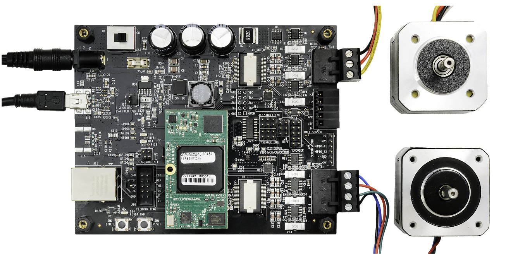

---

Smart Fusion 2 Dual-Axis Motor Control Starter Kit

DG0598 Demo Guide Revision 7.0 4

### 2.5.1.1 Connecting the Board

### The following steps describe how to connect the board:

1. Connect the 24 V power supply to J12connector.
2. Connect the BLDC motor (QBL4208-41-04-006) to J2connector.

- Black wire \- U-Phase of the motor
- Red wire \- V-Phase of the motor
- Yellow wire \- W-Phase of the motor

3. Connect the Stepper motor (QSH4218-35-10-027) to J3connector.

- Black wire \- A1 of the motor to be connected to PHS 4
- Green wire \- A2 of the motor to be connected to W
- Red wire \- B1 of the motor to be connected to V
- Blue wire \- B2 of the motor to be connected to U

4. Set the required jumpers on the board. For information on jumper settings, see Table 2, page 28.
5. Switch ONthe power supply switch, SW3.
6. Connect the Flash Pro JTAG to the FP header.
7. Open the Flash Pro software and program the STAPL file (SK2ABLSLST 10_5_2.stp).
8. Power cycle the board using SW3.

### 2.5.1.1 连接电路板

以下步骤描述如何连接电路板：

1. 将 24 V 电源连接到 J12 连接器。
2. 将 BLDC 电机 (QBL4208-41-04-006) 连接到 J2 连接器。
   * 黑线 - 电机的 U 相
   * 红线 - 电机的 V 相
   * 黄线 - 电机的 W 相
3. 将步进电机 (QSH4218-35-10-027) 连接到 J3 连接器。
   * 黑线 - 电机的 A1，连接到 PHS4
   * 绿线 - 电机的 A2，连接到 W
   * 红线 - 电机的 B1，连接到 V
   * 蓝线 - 电机的 B2，连接到 U
4. 设置电路板上所需的跳线。有关跳线设置的信息，请参见第 28 页的表 2。
5. 接通电源开关 SW3。
6. 将 FlashPro JTAG 连接到 FP 接头。
7. 打开 FlashPro 软件，烧录 STAPL 文件 (SK2ABLSLST10_5_2.stp)。
8. 使用 SW3 对电路板重新上电。

### 2.5.2 Installing the Motor Control GUI

### The following steps describe how to install the motor control GUI:

1. Go to the GUI folder and runsetup.exe.
2. Click Yesfor any message from User Account Control.

Setup window is displayed with the default locations.

3. Click Next.

a. Accept the license agreement and click Next.
b. Confirm the installation location in the installation dialog box and click Next.

A progress bar appears that shows the progress of the installation. On successful installation, Installation Completemessage is displayed.

4. Click Finish to exit the installation wizard.
5. Restart the host PC.
6. Check the device manager to see, if the USB drivers are already configured on the host machine.
7. Check if the drivers are configured correctly, after ensuring that the hardware is powered ONand

connected to the host PC using USB cable (J17 connector on board).

---

Smart Fusion 2 Dual-Axis Motor Control Starter Kit

DG0598 Demo Guide Revision 7.0 5

8. Check if NI-VISA USB devicesappears in the device manager as shown in the following figure. If

they are configured, skip to Running the Demo Design, page 12.

Figure 2 • Identifying the Smart Fusion 2 Motor Control Kit USB Driver

### 2.5.2 安装电机控制 GUI

以下步骤描述如何安装电机控制 GUI：

1. 进入 GUI 文件夹，运行 setup.exe。
2. 对于用户帐户控制发出的任何消息，单击“是”。

此时会显示安装窗口，并显示默认位置。

3. 单击“下一步”。
   a. 接受许可协议，然后单击“下一步”。
   b. 在安装对话框中确认安装位置，然后单击“下一步”。

此时会出现一个进度条，显示安装进度。安装成功后，会显示“安装完成”消息。

4. 单击“完成”退出安装向导。
5. 重新启动主机 PC。
6. 检查设备管理器，查看 USB 驱动程序是否已在主机上配置。
7. 确保硬件已通电并使用 USB 线缆（板上的 J17 连接器）连接到主机 PC 后，检查驱动程序是否配置正确。

---

SmartFusion2 双轴电机控制入门套件

DG0598 演示指南 修订版 7.0 第 5 页

8. 检查设备管理器中是否出现 NI-VISA USB 设备，如下图所示。如果已配置，则跳至第 12 页“运行演示设计”。

图 2 • 识别 SmartFusion2 电机控制套件 USB 驱动程序

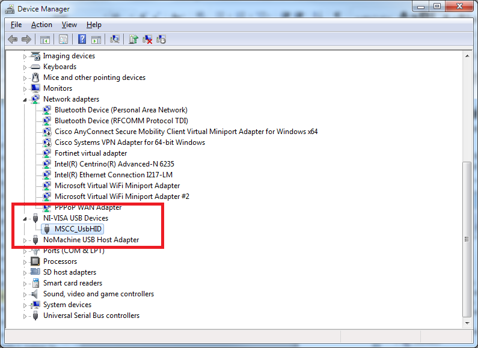

### 2.5.2.1 GUI Driver Configuration

The following steps describe how to install the GUI driver on the host PC that has Windows 7 or above installed. The downloaded programming file must be programmed on the board before proceeding for driver installation.

1. Connect the host PC to the J17 connector on the Smart Fusion 2 Motor Control Kit using the USB A

to mini-B USB cable.

2. Connect the power adapter to the kit and switch ONthe SW3switch.

---

Smart Fusion 2 Dual-Axis Motor Control Starter Kit

DG0598 Demo Guide Revision 7.0 6

3. Open Device Manager of the host PC and select USB Input Deviceunder Human Interface

Devices, as shown in the following figure.

Figure 3 • Device Manager

### 2.5.2.1 GUI 驱动程序配置

以下步骤描述了如何在安装了 Windows 7 或更高版本的主机 PC 上安装 GUI 驱动程序。在继续安装驱动程序之前，必须将下载的编程文件烧录到电路板上。

1. 使用 USB A 转 mini-B USB 线缆将主机 PC 连接到 SmartFusion2 电机控制套件上的 J17 连接器。
2. 将电源适配器连接到套件，并打开 SW3 开关。

---

SmartFusion2 双轴电机控制入门套件

DG0598 演示指南 修订版 7.0 第 6 页

3. 打开主机 PC 的设备管理器，并在“人机接口设备”下选择“USB 输入设备”，如下图所示。

图 3 • 设备管理器

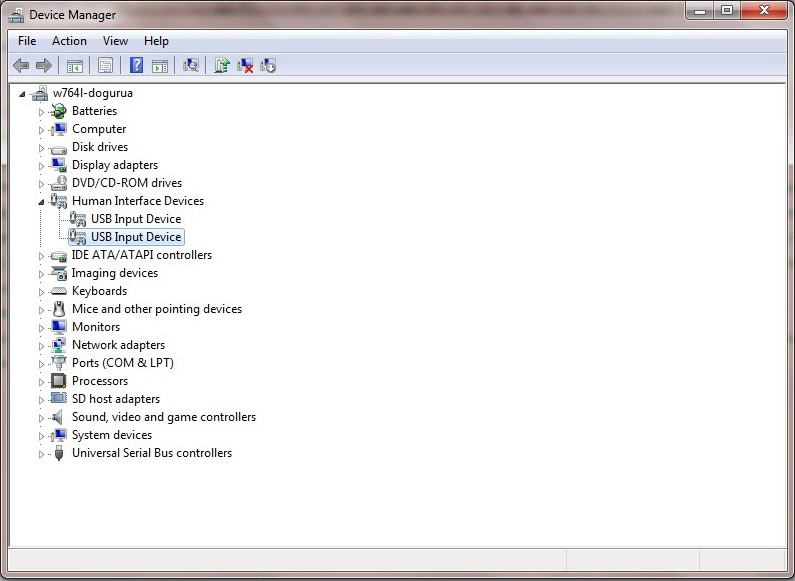

---

Smart Fusion 2 Dual-Axis Motor Control Starter Kit

DG0598 Demo Guide Revision 7.0 7

4. Right-click USB Input Deviceand select Properties.

Figure 4 • Installing the USB Driver \- Opening the Properties Window

4. 右键单击“USB 输入设备”，然后选择“属性”。

图 4 • 安装 USB 驱动程序 - 打开属性窗口

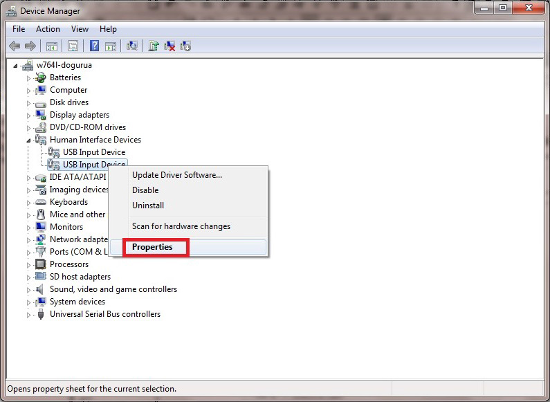

The following figure shows the USB Input Device Propertieswindow.

5. In the Details tab, select Hardware Idsunder Property.

---

Smart Fusion 2 Dual-Axis Motor Control Starter Kit

DG0598 Demo Guide Revision 7.0 8

6. Verify that the VID number is 1514. If not, go to Step 3 and select a different device and try again.

Figure 5 • Selecting the Right VID Number in the Properties Window

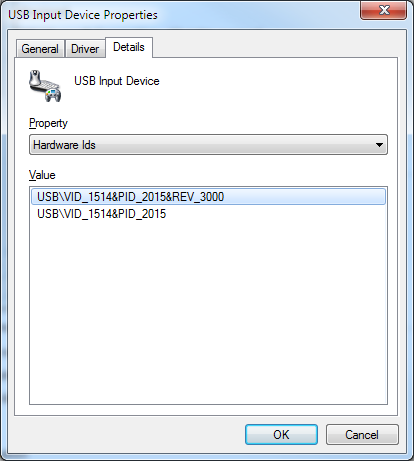

7. In the Device Managerwindow, right-click the USB Input Devicewith the specified VID number

   and select Update Driver Software, as shown in the following figure.

   ### Figure 6 • Updating Driver Software

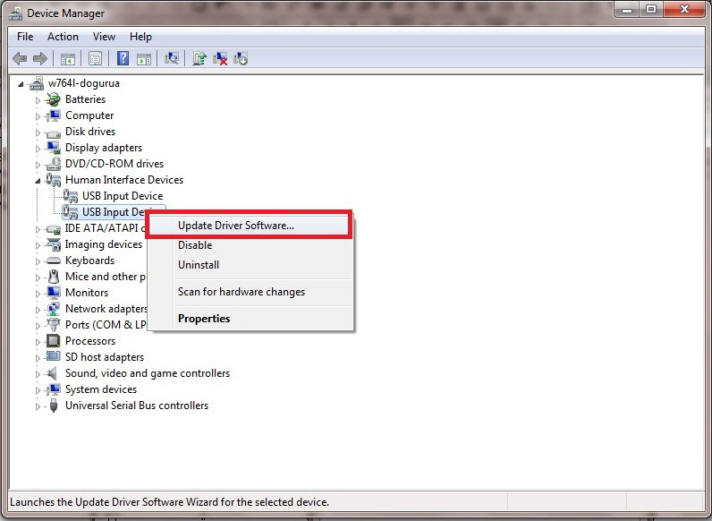

---

Smart Fusion 2 Dual-Axis Motor Control Starter Kit

DG0598 Demo Guide Revision 7.0 9

8. Select Browse my computer for driver softwarefrom the Update Driver Software \- USB Input

Devicewindow.

Figure 7 • Updating Driver Software \- Locate and Install the Driver Software Manually

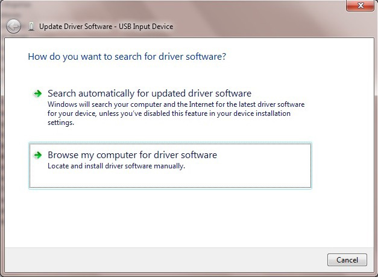

9. Click Let me pick from a list of device drivers on my computerand click Nextas shown in the

following figure.

Figure 8 • Updating Driver Software \- Selecting the Driver Location

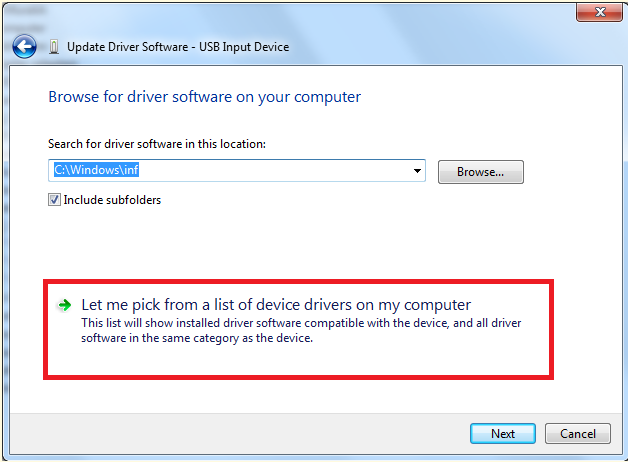

---

Smart Fusion 2 Dual-Axis Motor Control Starter Kit

DG0598 Demo Guide Revision 7.0 10

10. Select MSCC_Usb HIDand click Next.

Figure 9 • Model Selection

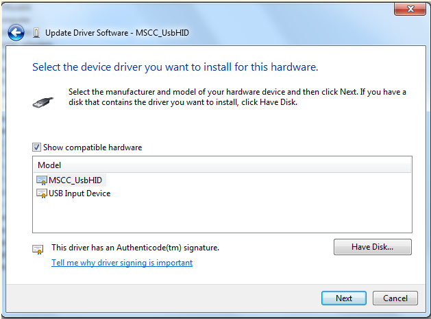

11. Click Install.

Figure 10 • Windows Security Dialog

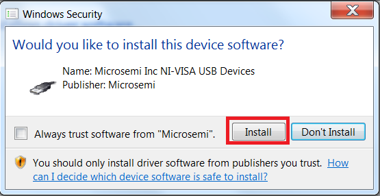

---

Smart Fusion 2 Dual-Axis Motor Control Starter Kit

DG0598 Demo Guide Revision 7.0 11

After successful installation, the following window is displayed.

Figure 11 • Successful Installation Message

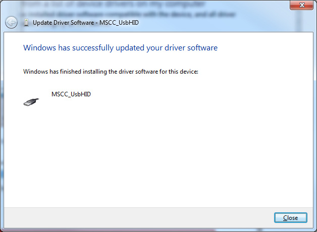

12. Check for NI-VISA-USB Devicesin the Device Managerwindow to ensure that the driver is

installed successfully.

Figure 12 • Verifying the Installed Driver Software

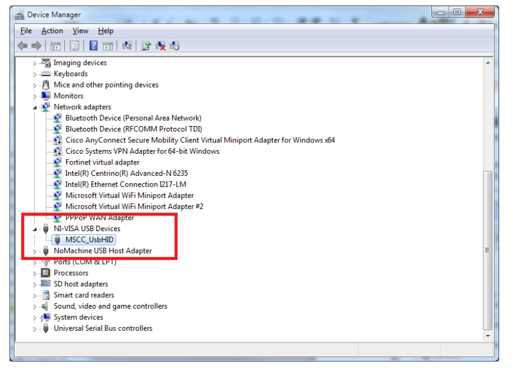

---

Smart Fusion 2 Dual-Axis Motor Control Starter Kit

DG0598 Demo Guide Revision 7.0 12

### 2.6 Running the Demo Design

### The following steps describe how to run the demo design:

1. After installing the GUI, go to Startmenu and select SF2 Dual Axis Motor Control GUIto open the

GUI as shown in the following figure.

Figure 13 • Launching the Smart Fusion 2 Dual-Axis Motor Control GUI

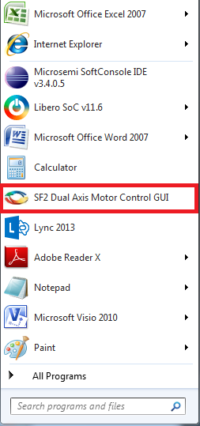

---

Smart Fusion 2 Dual-Axis Motor Control Starter Kit

DG0598 Demo Guide Revision 7.0 13

2. In the Smart Fusion 2 Motor Control GUI, select the USB devicewith VID 0x1514 and PID 0x2015

(USB 0:: 0x1514:: 0x2015..) from the USB DEVICEdrop-down list.

turns green.

Figure 14 • Smart Fusion 2 Motor Control GUI \- Launch Window

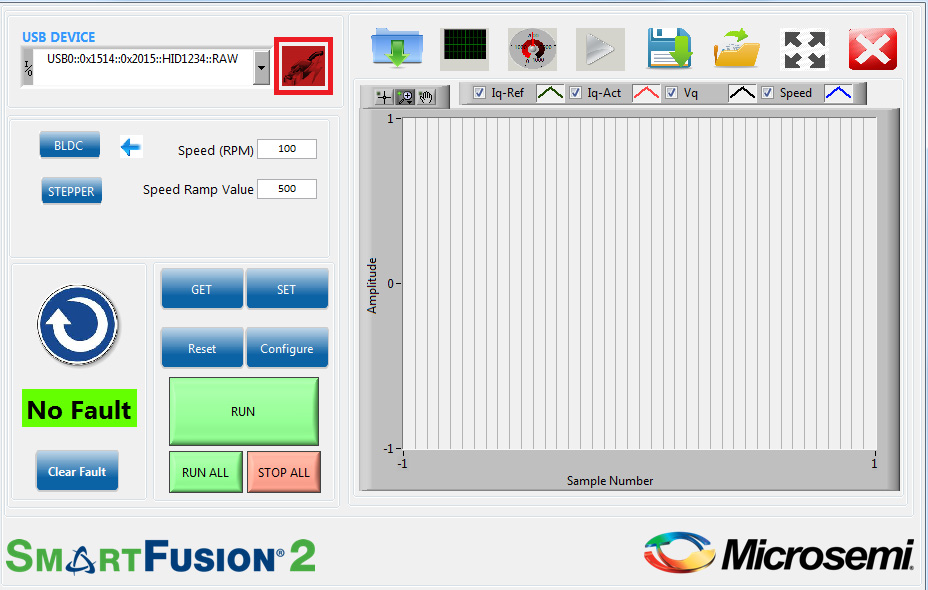

3. Click Connect. On successful connection, the Connect button (highlighted in Figure 14, page 13)

---

Smart Fusion 2 Dual-Axis Motor Control Starter Kit

DG0598 Demo Guide Revision 7.0 14

2.7 Running the BLDC Motors

Use the GETand SEToptions to modify or verify the motor speed, motor ramp rate, current and speed loop PI controller parameters, and angle correction PI parameters. Click Configureto invoke the Configure Motor Parameterswindow.

Figure 15 • Smart Fusion 2 Motor Control GUI \- BLDC Motor Screen

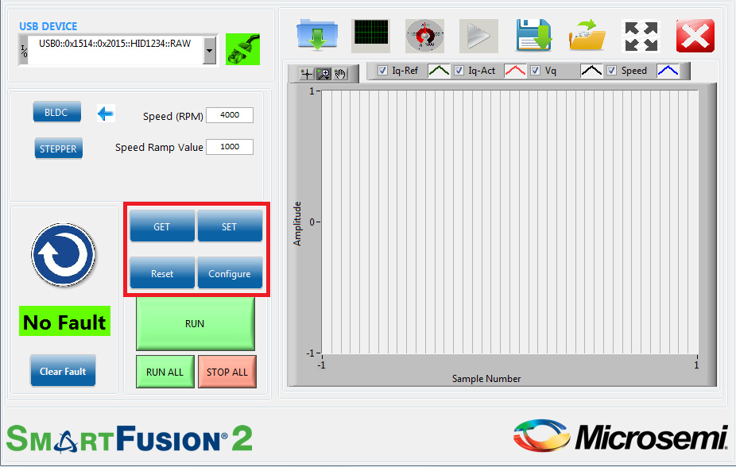

The PI controller parameters (Kp and Ki values) can be modified using the Configure Motor Parameterswindow shown in Figure 16, page 15. The Configure Motor Parameterswindow allows to change PI controller constants, startup mode, soft stop setting, Closed Loop Speed threshold, Open Loop Current, and Voltage.

---

Smart Fusion 2 Dual-Axis Motor Control Starter Kit

DG0598 Demo Guide Revision 7.0 15

On clicking, Configure Motor Specificationhighlighted in the following figure, Motor Specifications Configurationwindow opens, which allows to change the listed parameters.

Figure 16 • Configuring Motor Parameters Window

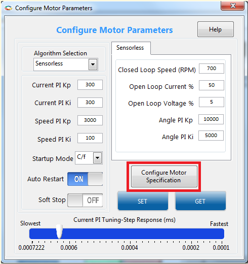

Figure 17 • Motor Specifications Configuration Window

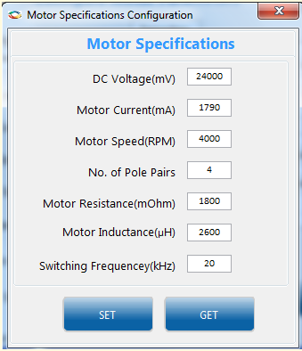

- To modify a parameter, change the required field and click SET.
- To check the data in the hardware corresponding to each parameter, click GET.
- To run the motor, click RUNand to stop the motor, click STOP.

4. Click Run Allto run all the motors and click Stop Allto stop all the running motors. These buttons

are highlighted in the following figure.

---

Smart Fusion 2 Dual-Axis Motor Control Starter Kit

DG0598 Demo Guide Revision 7.0 16

In the event of a fault occurrence, it is indicated in the indicator above the Clear Fault button. To clear a Fault, click Clear Faulthighlighted in the following figure.

Figure 18 • Smart Fusion 2 Motor Control GUI \- Run or Stop All Motors

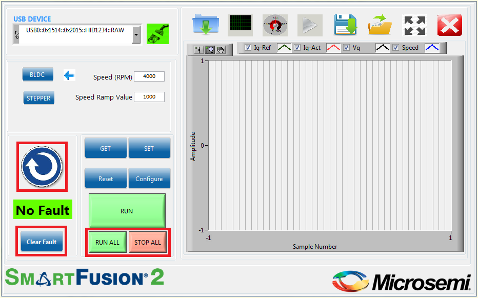

Click Motor Directionto set the motor direction. This button also indicates the current motor direction.

---

Smart Fusion 2 Dual-Axis Motor Control Starter Kit

DG0598 Demo Guide Revision 7.0 17

5. The GUI automatically plots waveforms when motor starts running. The plotting can be paused by

clicking the pause button highlighted in the following figure.

### Figure 19 • Smart Fusion 2 Motor Control GUI \- Start Plotting

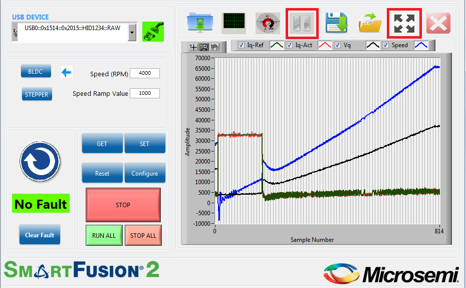

6. Click Expand Plot Windowto display the debug waveforms in a separate window as shown in the

following figure. Use the graph palette highlighted in the following figure to expand and analyze the waveforms.

Figure 20 • Plot Waveforms Window

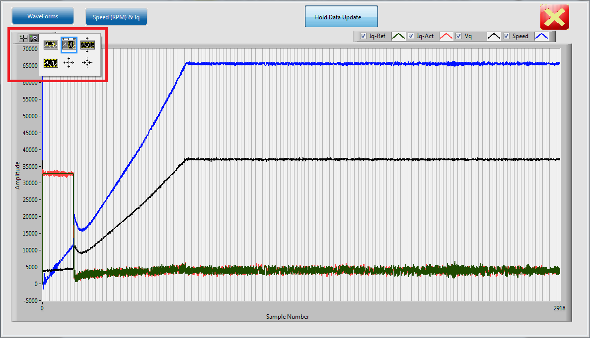

---

Smart Fusion 2 Dual-Axis Motor Control Starter Kit

DG0598 Demo Guide Revision 7.0 18

> Note: The following figure shows the plots corresponding to the motor axis. All plots are in per unit where a

value of 65536 represents the rated value.

Figure 21 • Plot Waveforms Window with Options

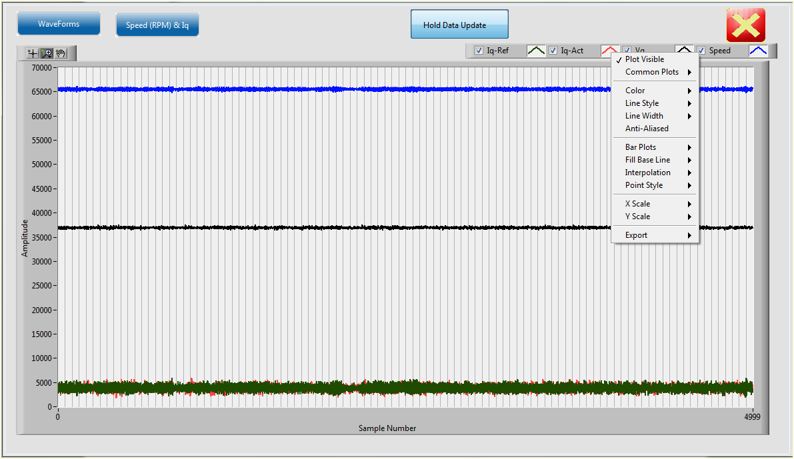

7. Right-click on the plot menu to invoke the following options:

a. Click next to each plot to use the available options.
b. Use the graph palette highlighted in Figure 20, page 17 to move cursors, zoom, or to pan the dis-
  play. The graph palette appears with the following options, in order from left to right:

- Pointer Tool: Changes cursor mode to basic pointer
- Zoom: Zooms in and out of the display.
- Panning Tool: Picks up the plot and moves it around the display.

8. Click Close Zoom viewto close the waveforms window.

---

Smart Fusion 2 Dual-Axis Motor Control Starter Kit

DG0598 Demo Guide Revision 7.0 19

9. To view the motor speed on a tachometer dial, click RPM and Currentas highlighted in the following

figure.

Figure 22 • Smart Fusion 2 Motor Control GUI \- Displaying Speed and Current

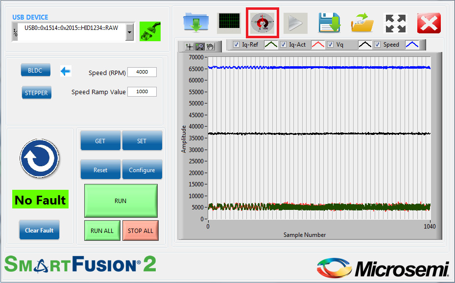

---

Smart Fusion 2 Dual-Axis Motor Control Starter Kit

DG0598 Demo Guide Revision 7.0 20

10. Click Save Waveformto save the current waveform in the GUI as a.tdmsfile. The saved waveform

can be reloaded by using the Load Waveformoption and loading the.tdmsfile.

Figure 23 • Smart Fusion 2 Motor Control GUI \- Saving and Loading Waveforms

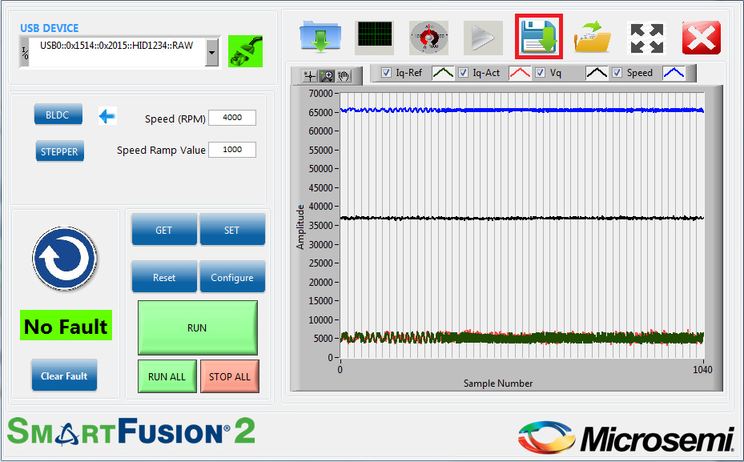

### 2.8 Running Stepper Motors

This design runs stepper motors in Continuous Mode and Position Mode:

> Note: The Continuous Mode is selected by default.

---

Smart Fusion 2 Dual-Axis Motor Control Starter Kit

DG0598 Demo Guide Revision 7.0 21

### 2.8.1 Continuous Mode

In Continuous mode, the motor rotates continuously in the speed that is set by the user. Click Stopto stop the running motor.

1. Click Stepperto select the stepper motor.
2. Verify that the Speed modeoption is selected.
3. Click GETto see the current parameters. Click Configureto open a list of configurable parameters.
4. Click Resetto reset all the stepper parameters to their default values, and click SETto enter these

values into the system.

5. Click RUNto run the motor with the current parameters.
6. Select step resolution value from the Step Resolutiondrop-down list.

Figure 24 • Smart Fusion 2 Motor Control GUI \- Stepper Motor Window

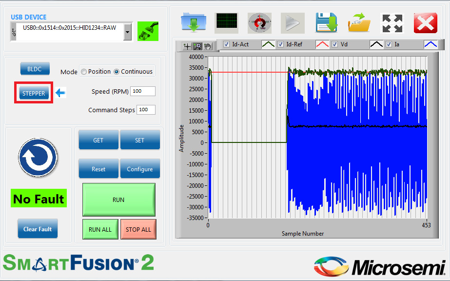

7. Enter a speed value between 1 and 200 RPM in Speed (RPM) and click SET.

> Note: It is not necessary to stop the motor to change motor speed or the step resolution.
> Note: To change the direction of the motor, click Motor Direction.

8. To increase motor torque, increase the current reference and click SET.

CAUTION: Increasing the current scaling value increases the motor current and the motor gets heated if run for a long time.

9. Click STOPto stop the motor.

### 2.8.2 Position Mode

In Position mode, the motor rotates and stops as per the command steps. It rotates in the speed that is set by the user.

1. Select Position modeoption and click SET.
2. Enter the required (absolute) position in Command Steps.

a. The motor provided with the kit has a step number of 200 by default. To run the motor through one revolution, enter 200 in Command Steps.

b. Click SET.
c. Click RUN. The motor runs through the specified number of steps.

---

Smart Fusion 2 Dual-Axis Motor Control Starter Kit

DG0598 Demo Guide Revision 7.0 22

• In the Position mode, the motor moves through a fixed number of steps after which the motor stops rotating, but remains energized.

- To move to a different position, enter the new position and click SET.
- Click STOPto de-energize the motor. When the motor is de-energized, the current position is
  lost.

Plotting debug parameters by clicking Plot Waveforms, displays Id PI output as plot 0, d-axis motor current (Id) as plot 1, the number of steps moved (step count) as plot 2, and the angle generated as plot 3. The following figure shows the GUI in position mode.

Figure 25 • Smart Fusion 2 Motor Control GUI \- Stepper Motor in Position Mode

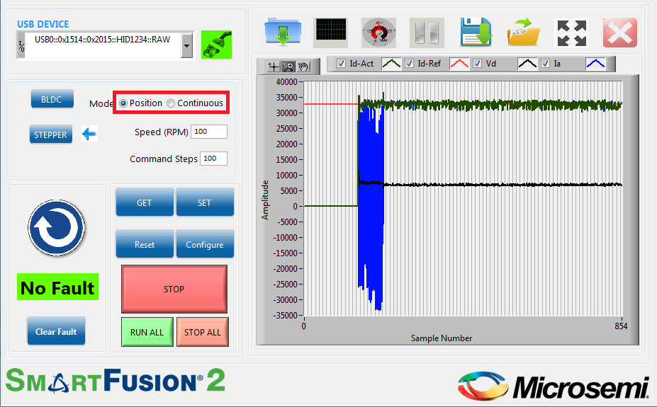

The motor runs at the speed set by the user in Speed (RPM) through the number of steps entered in Command Stepsas shown in the preceding figure.

---

Smart Fusion 2 Dual-Axis Motor Control Starter Kit

DG0598 Demo Guide Revision 7.0 23

3. Click Configureto open the Configure Stepper Motor Parameterswindow, as shown in the

following figure.

Figure 26 • Configure Stepper Motor Parameters Window

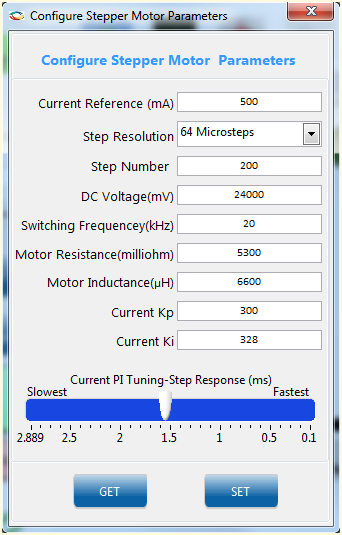

4. Click STOPto stop the motor/de-energize the motor.
5. Click EXITto exit the Smart Fusion 2 Motor Control GUI.

---

Smart Fusion 2 Dual-Axis Motor Control Starter Kit

DG0598 Demo Guide Revision 7.0 24

### 2.9 Register Dump Feature

The register dump feature generates a csv file with data to be programmed in each FPGA register, which is calculated based on motor configuration inputs.

1. Click the icon marked in the following figure to open the Register Dump window.

### Figure 27 • Register Dump window

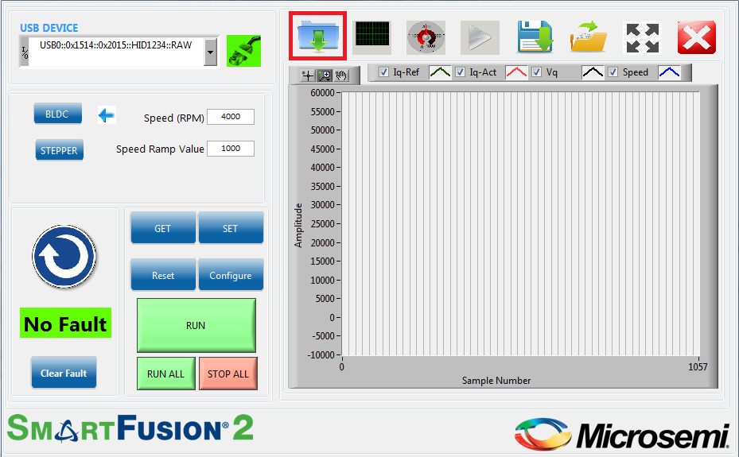

---

Smart Fusion 2 Dual-Axis Motor Control Starter Kit

DG0598 Demo Guide Revision 7.0 25

2. The following figure shows the BLDC tabof the register dump window. The Save to Filebutton

opens a dialog box to specify the location and the name of the csv file. The generated csv file contains only the data corresponding to the BLDC blocks.

Figure 28 • Register Dump window-BLDC Tab

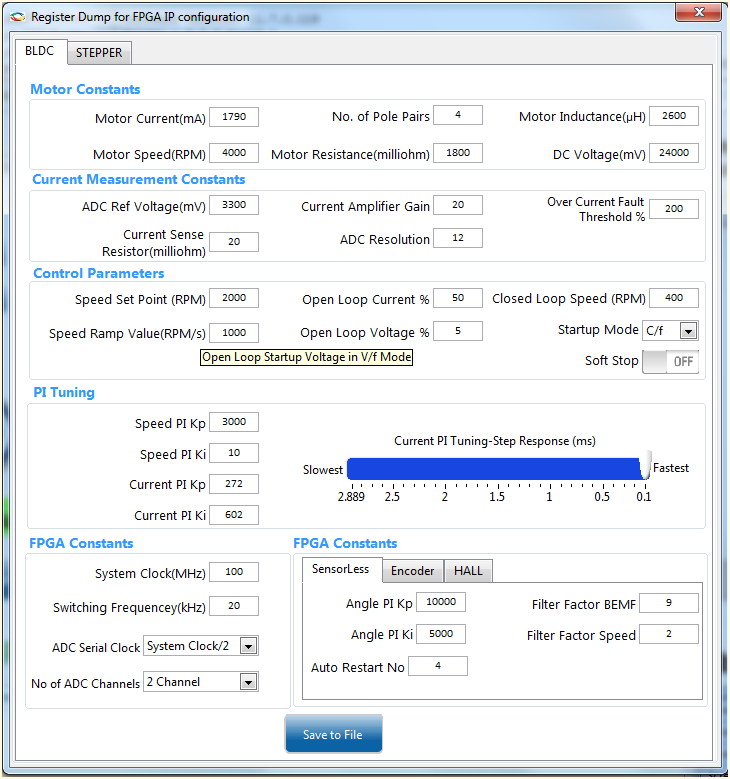

---

Smart Fusion 2 Dual-Axis Motor Control Starter Kit

DG0598 Demo Guide Revision 7.0 26

3. The following figure shows the Stepper tabof the register dump window. The Save to Filebutton

opens a dialog box to specify the location and the name of the csv file. The generated csv file contains only the data corresponding to the stepper blocks.

Figure 29 • Register Dump window-Stepper Tab

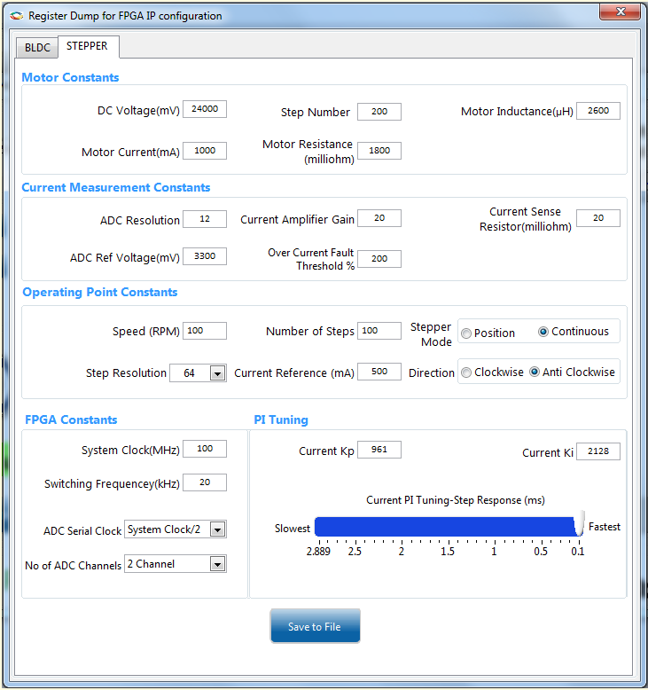

---

Smart Fusion 2 Dual-Axis Motor Control Starter Kit

DG0598 Demo Guide Revision 7.0 27

4. The following figure shows a sample csv file, which contains data calculated based on the inputs provided in the register dump window.

Figure 30 • Sample Csv File

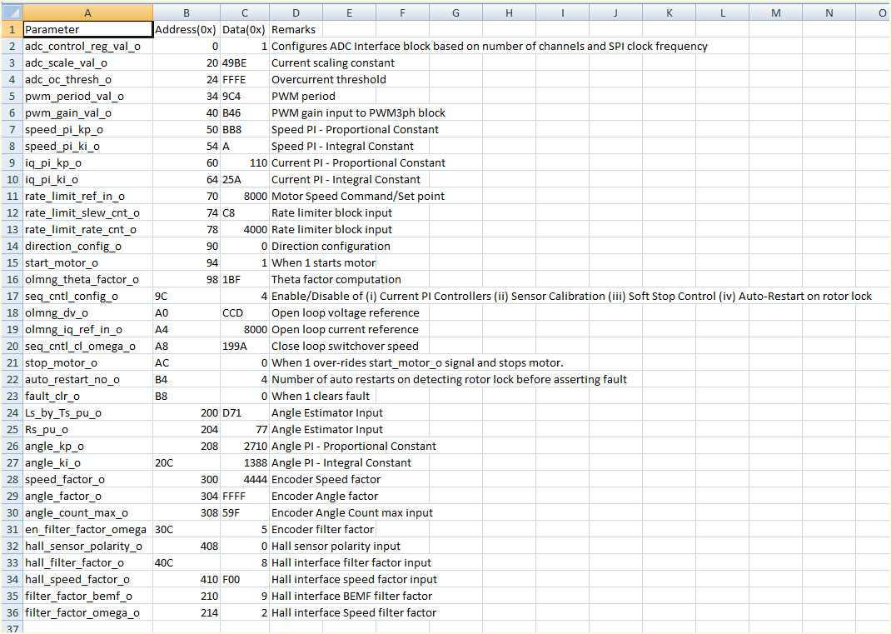

---

### Appendix: Jumper Settings

DG0598 Demo Guide Revision 7.0 28

# 3 Appendix: Jumper Settings

The following table lists the jumpers that are required to be set on the Smart Fusion 2 Starter Kit board.

表 2 • SmartFusion2 入门套件板上的跳线设置

| 跳线           | 功能                   | 默认设置 | 备注                   |
| -------------- | ---------------------- | -------- | ---------------------- |
| **电源** |                        |          |                        |
| J23            | SOM 电源来源           | 1-3 闭合 | 板上电源为 SOM 供电    |
| J22            | JTAG 模式              | 3-4 闭合 | JTAG VPP 接 3.3 V      |
| J7, J13        | 编码器 – 单端选择     | 打开     | 需设置为单端编码器     |
| J8             | 编码器 – 差分选择     | 打开     | 需设置为差分编码器     |
| J19            | 用于功率测量的分流电阻 | 打开     | 可在分流电阻上测量电压 |
| J11            | 编码器                 | 打开     | 连接编码器的端口       |

The following figure shows the Jumpers on Smart Fusion 2 Starter Kit.

Figure 31 • Jumpers on Smart Fusion 2 Starter Kit

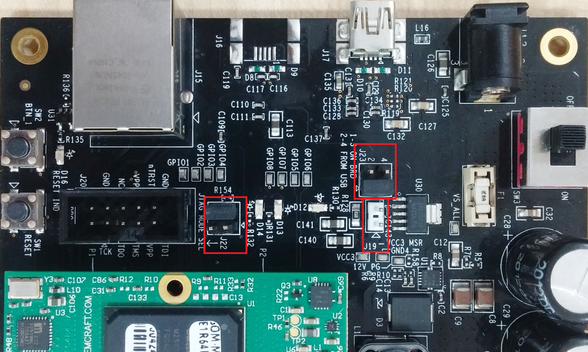

---

### Appendix: Connecting the Motor Terminals

```text
DG0598 Demo Guide Revision 7.0 29
```

# 4 Appendix: Connecting the Motor Terminals

### 4.1 BLDC Motor Connections

The following steps describe how to connect to the BLDC motor:

1. Identify and isolate the BLDC Motor Terminals (set of 3) and Hall Sensor Terminals (set of 5), as

shown in the following figure. These terminals are tied together.

2. Connect the BLDC Motor Terminalsto the three pin plug.
3. Connect the Hall Sensor Terminalsto the five pin plug.

### Figure 32 • Wiring Diagram for BLDC Motor Connectors

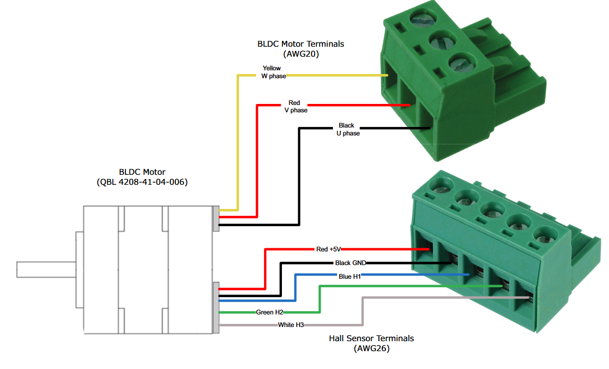

---

DG0598 Demo Guide Revision 7.0 30

### 4.1.1 Stepper Motor Connections

The stepper motor has four terminals. The motor terminals of the stepper motor must be connected to the four pin plug, as shown in the following figure.

### Figure 33 • Wiring Diagram for Stepper Motor Connectors

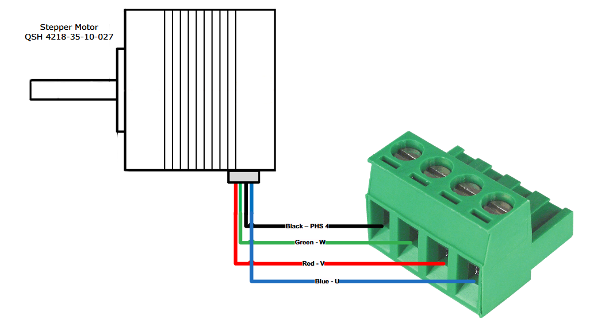
